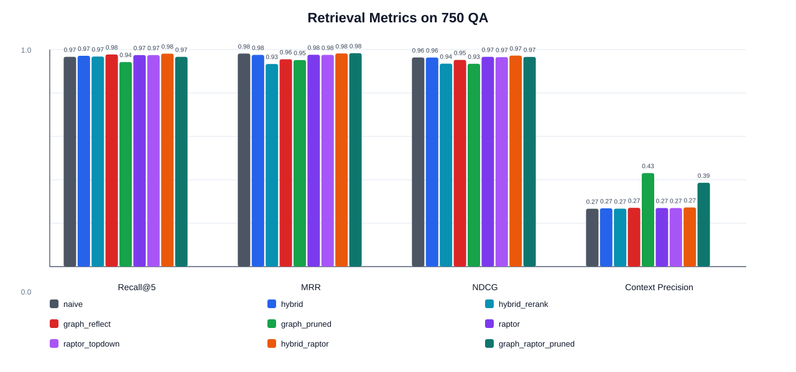
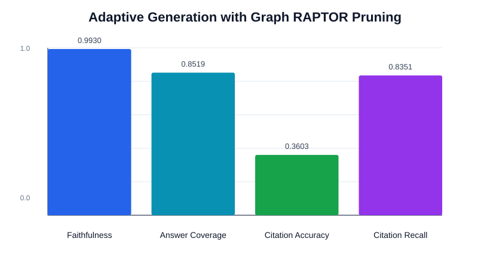

# Project Showcase

## 项目一句话

面向计算机课程问答，将原来的基础 RAG 小实验升级为可复现的成熟 RAG 研究型项目：系统支持扩展数据集、BM25 + dense 混合检索、GraphRAG、RAPTOR summary tree、Hybrid RAPTOR 融合检索、证据压缩、自适应生成预算、分组检索评估和分组生成评估。

## 核心结果





## 关键发现

- 数据集已从 34 个知识块和 100 条 QA 扩展到 150 个课程文档和 750 条标注 QA，并覆盖 citation-grounded、title-explicit、paraphrase 和 multi-hop paraphrase 问题。
- `hybrid_raptor` 在整体检索上表现最好：Recall@5 = 0.9813，MRR = 0.9822，NDCG = 0.9723。
- `graph_raptor_pruned` 更偏向高质量上下文：Recall@5 = 0.9667，MRR = 0.9833，Context Precision = 0.5353，高于未压缩融合检索的 0.2725。
- 在更难的 paraphrase 子集上，`graph_raptor_pruned` 的 Context Precision = 0.4433，说明证据压缩对低噪声引用更有价值。
- 生成评估采用 `graph_raptor_pruned` + adaptive top-k：Faithfulness = 0.9909，Answer Coverage = 0.9814，Citation Recall = 0.9687。
- RAPTOR 的 summary node 目前采用本地确定性摘要器，保证测试和实验可复现；后续可切换为 LLM summarizer 或更强 embedding backend。

## 当前推荐命令

```powershell
cs-rag build-expanded-dataset
cs-rag prepare
cs-rag train-reranker
cs-rag build-raptor-tree
cs-rag evaluate
cs-rag evaluate-generation --method graph_raptor_pruned --top-k 3 --adaptive-top-k --multi-hop-top-k 4
cs-rag build-showcase
pytest -q
```

## 推荐展示口径

这个项目的重点不是把一个 demo 包装成复杂系统，而是把 RAG 中常见的三类矛盾拆开验证：召回更多证据、控制上下文噪声、让生成答案保持可引用。扩展数据集之后，RAPTOR 负责提供层次化语义摘要和跨 chunk 线索，GraphRAG 负责补充概念邻接关系，证据压缩负责把最终上下文收紧到更适合生成的证据集合。
