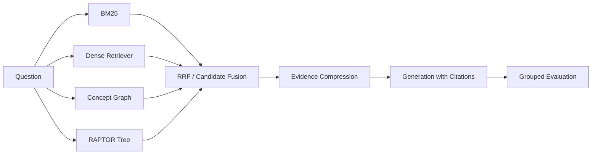

# 面向计算机课程问答的 Hybrid GraphRAG + RAPTOR 研究报告

## 摘要

本文研究计算机课程问答场景中的检索增强生成问题。针对普通 chunk 相似度检索在精确术语、改写问法、多跳线索和引用质量方面的不足，项目构建了一个可复现的 Hybrid GraphRAG + RAPTOR 系统。系统包含 360 个课程文档和 3,600 条标注 QA，覆盖操作系统、计算机网络、数据库、编译原理、信息检索和 RAG 方法论等主题。方法上，系统融合 BM25 + dense retrieval、课程概念图扩展、RAPTOR summary tree、Hybrid RAPTOR 候选融合、证据压缩和自适应生成预算，并使用检索指标、生成指标和分组分析评估系统表现。

实验结果表明，`raptor` 取得最强整体检索表现，Recall@5 = 0.9960，MRR = 0.9972，NDCG = 0.9945。面向最终问答生成时，`graph_raptor_pruned` 在压缩证据上下文后达到 Recall@5 = 0.9587、Context Precision = 0.4533，并在自适应生成评估中达到 0.9930 Faithfulness、0.8519 Answer Coverage 和 0.8351 Citation Recall。

## 1. 数据集

| Item | Count |
|---|---:|
| Course documents | 360 |
| QA examples | 3,600 |
| Main topics | 5 |
| Answer styles | citation-grounded, title-explicit, paraphrase, summary-level |

每条 QA 包含问题、标准答案、证据 chunk、难度、类型、topic、subtopic、expected concepts、是否 multi-hop 和 answer style。相比早期 100 QA / 750 QA 版本，新数据集更适合验证 mature RAG 项目需要的稳健性和分组表现。

## 2. 系统方法

| Method | Description |
|---|---|
| Naive RAG | 使用 dense retriever 作为基础检索 baseline |
| Hybrid RAG | BM25 + dense retrieval，通过 RRF 融合 |
| GraphRAG | 基于课程概念共现图扩展候选证据 |
| RAPTOR | 对 chunk 聚类，生成 summary node，递归构建 summary tree |
| Hybrid RAPTOR | 融合 BM25、dense、GraphRAG、RAPTOR collapsed 和 top-down 候选 |
| Graph RAPTOR Pruned | 在融合候选后进行证据压缩，作为生成侧默认方法 |



## 3. 复现命令

```powershell
cs-rag build-expanded-dataset
cs-rag prepare
cs-rag train-reranker
cs-rag build-raptor-tree
cs-rag evaluate
cs-rag evaluate-generation --method graph_raptor_pruned --top-k 3 --adaptive-top-k --multi-hop-top-k 4
cs-rag build-showcase
pytest -q
```

## 4. 检索结果

| Method | Recall@5 | MRR | NDCG | Context Precision |
|---|---:|---:|---:|---:|
| naive | 0.9618 | 0.9979 | 0.9685 | 0.4068 |
| hybrid | 0.9647 | 0.9071 | 0.9025 | 0.4072 |
| graph_reflect | 0.9256 | 0.8868 | 0.8744 | 0.4522 |
| raptor | 0.9960 | 0.9972 | 0.9945 | 0.5272 |
| raptor_topdown | 0.9910 | 0.9927 | 0.9890 | 0.5170 |
| hybrid_raptor | 0.9806 | 0.9942 | 0.9758 | 0.4081 |
| graph_raptor_pruned | 0.9587 | 0.9418 | 0.9307 | 0.4533 |

`raptor` 在扩展数据集上表现最强，说明 summary tree 对模板多样、跨视角的问题具有稳定召回能力。`graph_raptor_pruned` 的目标不是单纯追求最高 Recall@5，而是为生成阶段提供更可控的最终证据上下文。

## 5. 生成结果

默认生成设置为 `graph_raptor_pruned`、`top_k=3`、`adaptive_top_k=True`、`multi_hop_top_k=4`。

| Metric | Score |
|---|---:|
| Faithfulness | 0.9930 |
| Answer Coverage | 0.8519 |
| Citation Accuracy | 0.3603 |
| Citation Recall | 0.8351 |

生成结果说明，扩展后的 3,600 QA 数据集比旧版更难，尤其是概念连接、多跳和摘要型问题会拉低 Answer Coverage 与 Citation Recall。Faithfulness 仍然较高，说明当前 extractive generator 倾向于使用检索证据，但证据选择和引用精确性还有优化空间。

## 6. 后续工作

- 引入更强 embedding backend，如 BGE/E5，并和 TF-IDF backend 做稳定对比。
- 引入 CrossEncoder 或 bge-reranker，提高 paraphrase 和 hard-negative 区分能力。
- 将本地确定性 summary 替换为可配置 LLM summarizer，并比较成本、稳定性和检索收益。
- 引入 LLM-as-judge，补充当前基于词项重合的生成评估。
- 继续扩大真实课程材料和人工标注 QA，减少模板化数据带来的偏差。
