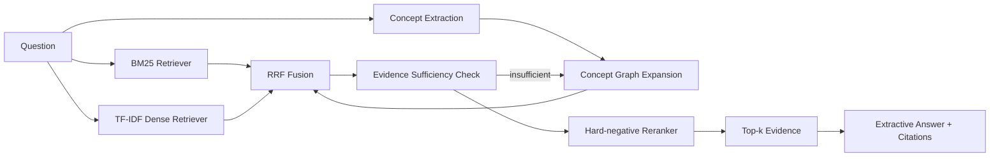

# 面向计算机课程问答的 Hybrid Self-Reflective GraphRAG 研究报告

## 摘要

本文研究计算机课程问答场景中的检索增强生成问题。针对普通向量 RAG 在精确术语匹配、多跳概念关联和证据排序方面的不足，本文构建了一个面向操作系统、计算机网络、数据库、编译原理和 RAG 方法论的课程问答实验系统。系统比较了 Naive RAG、Hybrid RAG、Hybrid + Reranker、Graph + Reflection RAG 和 Graph + Pruning RAG 五种方法，并使用 Recall@5、MRR、NDCG 和 Context Precision 进行检索质量评估。

实验结果显示，Graph + Reflection RAG 在 100 条标注问答上取得 0.9400 的 Recall@5、0.9183 的 MRR 和 0.9193 的 NDCG，显著高于 Naive RAG 的 0.7500、0.7633 和 0.7512。错误分析表明，概念图谱扩展能够补足普通检索在多跳问题和概念关联问题上的漏召回，但也会引入相邻概念噪声。为缓解该问题，本文进一步加入 Graph + Pruning RAG，在几乎保持召回率的同时将 Context Precision 从 0.4140 提升到 0.6450。

## 1. 研究背景

RAG 通过在生成答案前检索外部知识，可以缓解大模型知识过时和幻觉问题。然而在计算机专业课程问答中，问题往往包含精确术语、跨章节概念和多跳推理。例如“快照读和事务隔离级别之间有什么关系”同时涉及 MVCC 和事务隔离；“从正则表达式到词法分析器通常经历什么转换链路”需要把正则表达式、NFA、DFA 与词法分析联系起来。普通向量检索可能因为语义漂移、分块边界或术语稀疏而漏召回关键证据。

本文关注的问题是：

> 在计算机课程问答场景中，BM25 与向量检索融合、课程概念图谱扩展、候选集内 hard-negative 重排序训练，是否能够提升证据召回率与排序质量？

## 2. 系统方法

本文实现了五种对比方法。

| 方法 | 描述 |
|---|---|
| Naive RAG | 使用 dense retriever 作为基础检索 baseline；默认 TF-IDF，可切换为 BGE embedding |
| Hybrid RAG | 结合 BM25 稀疏检索和 dense retriever，并使用 RRF 融合排序 |
| Hybrid + Reranker | 在 Hybrid 初召回候选集上构造 hard negative，训练 Logistic Regression 重排序器 |
| Graph + Reflection RAG | 引入课程概念共现图进行候选扩展，并在证据不足时触发二次图检索 |
| Graph + Pruning RAG | 在 Graph + Reflection RAG 之后进行证据压缩，只保留更少、更高置信的候选证据 |

### 2.1 系统架构



### 2.2 Hybrid Retrieval

BM25 适合精确术语匹配，例如 `BCNF`、`TLB`、`MVCC` 等课程术语；dense retriever 适合同义表达或描述性问题。当前系统默认使用 TF-IDF 作为轻量可复现 baseline，同时支持通过 `sentence-transformers` 切换到 `BAAI/bge-small-zh-v1.5` 等真实 embedding 模型。本文使用 Reciprocal Rank Fusion 合并两类检索结果，使稀疏检索和语义检索互补。

### 2.3 Hard-negative Reranker

重排序器不直接在全部文本块上做粗粒度分类，而是在初召回候选集上训练。对于每个问题，标注证据为正样本，初召回中表面相似但不支持答案的文本块为 hard negative。当前实现使用基于特征的 Logistic Regression，特征包括初召回分数、问题与文档 token 相似度、标题匹配、概念重叠等。

### 2.4 Graph + Reflection RAG

系统从课程文本中抽取概念，例如“死锁”“银行家算法”“MVCC”“NFA”“GraphRAG”等，并基于概念共现构建轻量知识图谱。检索时，系统根据问题中的概念扩展相关文本块；若初始候选缺少相关概念，则触发二次图检索。该机制提升了多跳问题的召回能力，但也可能因为图邻居扩展带来噪声。

### 2.5 Graph + Pruning RAG

Graph + Pruning RAG 在图扩展和重排序之后增加证据压缩步骤。系统根据 reranker 分数、问题概念重叠和候选多样性，只保留更少、更高置信的证据块。该策略的目标不是继续提高召回，而是在召回基本稳定的前提下降低上下文噪声，提升 Context Precision 和 Citation Accuracy。

## 3. 数据集

当前实验数据由 5 个主题构成。

| 主题 | 示例知识点 |
|---|---|
| 操作系统 | 进程线程、同步互斥、死锁、虚拟内存、TLB、调度、文件系统 |
| 计算机网络 | TCP/UDP、三次握手、拥塞控制、DNS、HTTPS/TLS、NAT、子网划分 |
| 数据库 | 事务、隔离级别、B+树、MVCC、范式、查询优化 |
| 编译原理 | 词法分析、NFA/DFA、LL/LR 分析、语义分析、活跃变量、寄存器分配 |
| RAG 方法论 | BM25、向量检索、重排序、GraphRAG、Self-RAG、评测指标、LoRA |

当前版本包含 34 个课程知识点和 100 条标注问答。每条样本包含问题、标准答案、证据文本块、难度和问题类型。评测集覆盖定义、比较、解释、推理、多跳和错误分析类问题。

## 4. 实验设置

实验通过以下命令复现：

```powershell
cs-rag prepare
cs-rag train-reranker
cs-rag evaluate
```

代码会读取 `data/raw/cs_courses.md` 和 `data/qa/eval_qa.jsonl`，训练 reranker，并在 `reports/experiment_results.md` 与 `reports/error_analysis.md` 中生成指标和错误案例。

生成质量评测可通过以下命令运行：

```powershell
cs-rag evaluate-generation --method graph_pruned --top-k 3
```

该命令会生成 `reports/generation_results.md`，包含 Faithfulness、Answer Coverage、Citation Accuracy 和 Citation Recall。

若需要使用 BGE embedding 检索，可执行：

```powershell
pip install -r requirements-embeddings.txt
$env:CS_RAG_DENSE_BACKEND="sentence-transformers"
$env:CS_RAG_EMBEDDING_MODEL="BAAI/bge-small-zh-v1.5"
cs-rag train-reranker
cs-rag evaluate
```

## 5. 评测指标

| 指标 | 含义 |
|---|---|
| Recall@5 | Top-5 检索结果中是否覆盖标注证据 |
| MRR | 第一个相关证据出现位置的倒数，衡量排序靠前程度 |
| NDCG | 综合考虑多个相关证据及其排序位置 |
| Context Precision | 返回上下文中标注证据所占比例，衡量噪声程度 |

## 6. 实验结果

| Method | Recall@5 | MRR | NDCG | Context Precision |
|---|---:|---:|---:|---:|
| naive | 0.7500 | 0.7633 | 0.7512 | 0.5905 |
| hybrid | 0.7500 | 0.7583 | 0.7495 | 0.5905 |
| hybrid_rerank | 0.7500 | 0.7700 | 0.7554 | 0.5905 |
| graph_reflect | 0.9400 | 0.9183 | 0.9193 | 0.4140 |
| graph_pruned | 0.9367 | 0.9183 | 0.9173 | 0.6450 |

结果表明，Hybrid + Reranker 相比 Hybrid 的 MRR 从 0.7583 提升到 0.7700，说明候选集内 hard-negative 训练能够改善部分问题的证据排序。Graph + Reflection RAG 的 Recall@5、MRR 和 NDCG 均明显提升，说明课程概念图谱对多跳问题和概念关联问题具有召回增益。

与此同时，Graph + Reflection RAG 的 Context Precision 明显下降。这说明图扩展虽然增加了召回范围，但会引入相关课程主题下的相邻概念文本。例如问题命中“TCP”时，图扩展可能同时召回三次握手、HTTPS/TLS、DNS 等网络主题证据。Graph + Pruning RAG 将返回证据压缩到更高置信的少量文本块，Recall@5 从 0.9400 小幅下降到 0.9367，但 Context Precision 从 0.4140 提升到 0.6450，说明证据压缩能有效降低图扩展噪声。

## 7. 错误案例分析

### 7.1 GraphRAG 补足漏召回

在以下问题中，Naive RAG 没有召回标注证据，而 Graph + Reflection RAG 成功召回并排到前列。

| 问题 ID | 问题 | 标注证据 | GraphRAG 结果 |
|---|---|---|---|
| q1 | 为什么线程切换通常比进程切换开销更低？ | os-进程与线程 | 召回且排第 1 |
| q27 | 图着色寄存器分配中为什么活跃区间冲突的变量不能使用同一寄存器？ | compiler-寄存器分配 | 召回且排第 1 |
| q39 | 快照读和事务隔离级别之间有什么关系？ | db-mvcc-与快照读、db-隔离级别与并发异常 | 两个证据均召回 |
| q41 | 从正则表达式到词法分析器通常经历什么转换链路？ | compiler-正则表达式-nfa-与-dfa | 召回且排第 1 |
| q48 | 为什么日志文件系统有助于崩溃恢复？ | os-文件系统与-inode | 召回且排第 1 |

这些案例说明，图扩展能够通过课程概念关系补足单纯文本相似度检索的漏召回。

### 7.2 图扩展引入噪声

GraphRAG 的主要问题是 Context Precision 下降。例如 q1 的标注证据为 `os-进程与线程`，但图扩展还召回了 `os-cpu-调度算法`、`os-虚拟内存与页面置换`、`os-死锁与银行家算法` 等同属于操作系统主题的文本。它们与问题主题相关，但并不直接支持答案。

这类错误说明，当前图扩展策略更偏向提高召回率，而不是精确控制证据边界。后续可以限制图扩展跳数、为图边加入关系类型权重，或在图扩展后加入更强的 CrossEncoder reranker。

### 7.3 证据压缩降低噪声

Graph + Pruning RAG 在 Graph + Reflection RAG 的候选结果上进行证据压缩。实验中，它在 Recall@5 几乎不变的情况下显著提升 Context Precision。该结果说明，GraphRAG 的主要问题不是无法召回正确证据，而是召回后缺少证据边界控制；通过剪枝保留更少、更高置信的候选，可以改善后续答案生成和引用质量。

### 7.4 Reranker 改善排序

在 q38 “最长前缀匹配在路由选择中解决什么问题？”中，Hybrid RAG 已召回 `net-ip-路由与-nat`，但排在第 2；加入 reranker 后，该证据被提升到第 1，MRR 从 0.5000 提升到 1.0000。这说明即使轻量重排序器也能在部分候选集内改善证据排序。

## 8. 生成质量评测

在检索评测之外，系统加入了抽取式答案生成与启发式生成质量评测。当前实现会从 Top-k 证据中为每个证据块选择与问题最相关的句子，并在答案中附加 citation。评测指标包括：

| 指标 | 含义 |
|---|---|
| Faithfulness | 生成答案中的内容词有多少能在检索上下文中找到支持 |
| Answer Coverage | 生成答案覆盖标准答案内容词的比例 |
| Citation Accuracy | 返回 citation 中有多少属于标注证据 |
| Citation Recall | 标注证据有多少被返回 citation 覆盖 |

当前抽取式生成的优势是 Faithfulness 较高，因为答案直接来自检索上下文；不足是 Answer Coverage 可能较低，因为它不一定复述标准答案中的抽象表达。后续接入真实 LLM 后，可以在保持 citation 约束的前提下生成更自然、更完整的答案，并继续使用这些指标评估忠实度和引用质量。

系统已经支持可选 OpenAI-compatible 生成后端。配置 `CS_RAG_LLM_BASE_URL` 和 `CS_RAG_LLM_MODEL` 后，可以通过 `--generator openai-compatible` 调用本地 Ollama 或兼容 `/v1/chat/completions` 的模型服务；若未配置 endpoint 或调用失败，则自动回退到抽取式生成。

当前 `graph_pruned` 方法在 Top-3 证据上的生成评测结果如下：

| Metric | Score |
|---|---:|
| Faithfulness | 0.7558 |
| Answer Coverage | 0.2073 |
| Citation Accuracy | 0.6450 |
| Citation Recall | 0.9367 |

该结果说明，抽取式答案大多来自检索上下文，因而具有较好的忠实度；Citation Recall 与检索 Recall@5 接近，说明标注证据基本能被返回；Citation Accuracy 相比未剪枝 GraphRAG 明显提升，说明证据压缩减少了无关 citation。Answer Coverage 较低则反映了抽取式句子与人工标准答案在表达方式上的差异。

## 9. 本地 Ollama LLM 实验

在抽取式生成 baseline 之外，项目进一步接入本地 Ollama 模型，验证“检索/重排序/证据压缩 + 真实 LLM 生成”的完整 RAG 链路。由于从 ModelScope 拉取的 Qwen2.5 GGUF 模型在 Ollama 中默认只有 `completion` 能力，本文为 0.5B 和 3B 模型分别构建了 Modelfile，补充 Qwen chat template，并通过 `--generator ollama` 调用 Ollama 原生 `/api/generate` 接口。

本地 LLM 实验设置如下：检索方法使用 `graph_pruned`，Top-k 证据数为 3，评测前 10 条 QA 样本。

| Model | Faithfulness | Answer Coverage | Citation Accuracy | Citation Recall |
|---|---:|---:|---:|---:|
| `qwen-rag:0.5b` | 0.7251 | 0.3151 | 0.6666 | 1.0000 |
| `qwen-rag:3b` | 0.3378 | 0.2383 | 0.6666 | 1.0000 |

从自动指标看，0.5B 模型的 Faithfulness 和 Answer Coverage 更高；但样例分析表明，它经常把多个检索片段直接拼接在一起，导致答案混入与问题无关的信息。3B 模型的词面重合指标较低，但回答更自然、更接近真实问答，并且在 prompt 约束后能够较稳定地原样引用证据 ID。该现象说明，RAG 生成评测不能只依赖词面重合指标，还需要结合人工样例分析，关注答案聚焦程度、引用格式和无关信息混入。

该实验的意义在于：项目已经不只是离线检索评测，而是完成了可复现的本地 LLM 端到端问答链路；同时也观察到小模型、本地模型和自动指标之间的典型误差，为后续改进 prompt、替换更强模型和引入 LLM-as-judge 评测提供了依据。

## 10. 结论

本文完成了一个面向计算机课程问答的 Hybrid Self-Reflective GraphRAG 实验系统。实验表明：

1. 仅使用向量检索会在部分精确术语和多跳概念问题上漏召回。
2. 候选集内 hard-negative reranker 可以改善部分问题的证据排序。
3. Graph + Reflection RAG 显著提升 Recall@5、MRR 和 NDCG，说明课程概念图谱对专业问答检索有效。
4. GraphRAG 同时降低 Context Precision，说明图扩展需要配合噪声抑制机制。
5. Graph + Pruning RAG 在几乎保持召回率的同时显著提升 Context Precision 和 Citation Accuracy，说明证据压缩是降低 GraphRAG 噪声的有效策略。

## 11. 不足与后续工作

当前系统仍有几个限制。第一，虽然系统已经支持 sentence-transformers embedding，但当前报告中的主结果仍基于轻量 TF-IDF baseline；本地尝试加载 `BAAI/bge-small-zh-v1.5` 时受 HuggingFace 下载速度影响超时，后续应在网络稳定或已有本地模型缓存的环境下补充 BGE/E5 embedding 对比实验。第二，reranker 使用 Logistic Regression，表达能力有限，后续可以替换为 CrossEncoder 或 bge-reranker。第三，系统已支持 OpenAI-compatible LLM 后端，但当前主报告仍采用抽取式生成作为可复现 baseline，后续应补充真实 LLM 的生成质量对比。第四，当前评测集规模为 100 条，后续可继续扩展到 200 条，并加入更多跨章节、多证据问题。

下一步计划是升级 embedding 与 reranker，并接入真实 LLM 生成答案，在检索指标之外继续评估回答忠实度和引用准确率。

## 12. 展示材料

项目提供一键生成展示材料的命令：

```powershell
cs-rag build-showcase
```

该命令会生成 `reports/final_showcase.md`、`reports/interview_cheatsheet.md`，以及 `reports/figures/` 下的 SVG 指标图。展示页用于提交材料或 GitHub README 扩展，面试讲稿用于准备 30 秒项目介绍、方法解释和常见追问。
