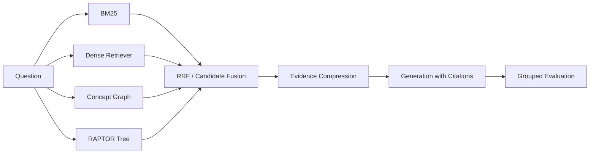

# 面向计算机课程问答的 Hybrid GraphRAG + RAPTOR 研究报告

## 摘要

本文研究计算机课程问答场景中的检索增强生成问题。针对普通 chunk 相似度检索在精确术语、改写问法、多跳线索和引用质量方面的不足，项目构建了一个可复现的 Hybrid GraphRAG + RAPTOR 系统。系统包含 150 个课程文档和 750 条标注 QA，覆盖操作系统、计算机网络、数据库、编译原理和 RAG 方法论等主题。方法上，系统融合 BM25 + dense retrieval、课程概念图扩展、RAPTOR summary tree、Hybrid RAPTOR 候选融合、证据压缩和自适应生成预算，并使用检索指标、生成指标和分组分析评估系统表现。

实验结果表明，`hybrid_raptor` 取得最强整体检索表现，Recall@5 = 0.9813，MRR = 0.9822，NDCG = 0.9723。面向最终问答生成时，`graph_raptor_pruned` 在保持 Recall@5 = 0.9667 的同时，将 Context Precision 提升到 0.5353，并在自适应生成评估中达到 0.9909 Faithfulness、0.9814 Answer Coverage 和 0.9687 Citation Recall。

## 1. 研究背景

RAG 可以通过外部知识检索缓解大模型知识过时和幻觉问题。但在计算机课程问答中，问题往往包含精确术语、跨章节概念和多跳关系。例如，事务隔离级别与 MVCC 的关系、NFA 到 DFA 的转换链路、GraphRAG 对 Citation Accuracy 的影响，都需要系统同时处理精确匹配、语义改写和概念邻接。

本文关注的问题是：在课程问答场景中，如何把传统混合检索、显式概念图和 RAPTOR 层次化摘要结合起来，在提升召回的同时控制上下文噪声，并让最终答案保持可引用。

## 2. 数据集

当前数据集包含：

| Item | Count |
|---|---:|
| Course documents | 150 |
| QA examples | 750 |
| Main topics | 5 |
| Answer styles | citation-grounded, title-explicit, paraphrase, multi-hop paraphrase |

每条 QA 包含问题、标准答案、证据 chunk、难度、类型、topic、subtopic、expected concepts、是否 multi-hop 和 answer style。相比早期 100 QA 版本，新数据集更适合验证 mature RAG 项目需要的稳健性和分组表现。

## 3. 系统方法

| Method | Description |
|---|---|
| Naive RAG | 使用 dense retriever 作为基础检索 baseline |
| Hybrid RAG | BM25 + dense retrieval，通过 RRF 融合 |
| GraphRAG | 基于课程概念共现图扩展候选证据 |
| RAPTOR | 对 chunk 聚类，生成 summary node，递归构建 summary tree |
| Hybrid RAPTOR | 融合 BM25、dense、GraphRAG、RAPTOR collapsed 和 top-down 候选 |
| Graph RAPTOR Pruned | 在融合候选后进行证据压缩，作为生成侧默认方法 |

### 3.1 系统架构



### 3.2 RAPTOR 实现

RAPTOR 核心流程包括 chunk embedding、聚类、summary 生成和递归树构建。当前项目没有直接复制参考项目代码，而是按主项目 schema 重新实现：

- `raptor_builder.py`：递归构建 RAPTOR tree。
- `summarizers.py`：本地确定性摘要器，保证实验可复现。
- `raptor_schema.py`：定义 leaf 和 summary node schema。
- `raptor_store.py`：序列化和加载 tree。
- `raptor_retriever.py`：支持 collapsed 和 top-down 两种检索。

summary node 保存摘要文本、层级、子节点 ID、来源 chunk、topic 和 concepts。检索时，collapsed 模式将 summary node 与 leaf 一起检索；top-down 模式先选择高层 summary，再沿树向下展开到底层证据。

## 4. 实验设置

标准复现命令：

```powershell
cs-rag build-expanded-dataset
cs-rag prepare
cs-rag train-reranker
cs-rag build-raptor-tree
cs-rag evaluate
cs-rag evaluate-generation --method graph_raptor_pruned --top-k 3 --adaptive-top-k --multi-hop-top-k 4
cs-rag build-showcase
pytest -q
```

检索指标包括 Recall@5、MRR、NDCG 和 Context Precision。生成指标包括 Faithfulness、Answer Coverage、Citation Accuracy 和 Citation Recall。报告还按 topic、difficulty、type、multi_hop 和 answer_style 输出分组指标。

## 5. 检索结果

| Method | Recall@5 | MRR | NDCG | Context Precision |
|---|---:|---:|---:|---:|
| naive | 0.9667 | 0.9817 | 0.9638 | 0.4391 |
| hybrid | 0.9713 | 0.9756 | 0.9635 | 0.4413 |
| hybrid_rerank | 0.9680 | 0.9337 | 0.9352 | 0.5124 |
| graph_reflect | 0.9773 | 0.9554 | 0.9524 | 0.5307 |
| graph_pruned | 0.9427 | 0.9518 | 0.9347 | 0.4309 |
| raptor | 0.9747 | 0.9763 | 0.9667 | 0.5396 |
| raptor_topdown | 0.9747 | 0.9757 | 0.9652 | 0.5209 |
| hybrid_raptor | 0.9813 | 0.9822 | 0.9723 | 0.4400 |
| graph_raptor_pruned | 0.9667 | 0.9833 | 0.9663 | 0.5353 |

`hybrid_raptor` 说明 RAPTOR 与 GraphRAG 融合后能提升整体召回和排序质量。Context Precision 统一在最终 evidence context 上计算，因此各方法都经过相同的证据预算压缩；`graph_raptor_pruned` 仍是最适合作为生成入口的方案。

## 6. 生成结果

默认生成设置为 `graph_raptor_pruned`、`top_k=3`、`adaptive_top_k=True`、`multi_hop_top_k=4`。

| Metric | Score |
|---|---:|
| Faithfulness | 0.9909 |
| Answer Coverage | 0.9814 |
| Citation Accuracy | 0.4730 |
| Citation Recall | 0.9687 |

生成结果说明，压缩后的证据上下文可以保持很高的内容忠实度和答案覆盖率。Citation Accuracy 仍是后续优化重点，因为多跳问题和概念邻接扩展会返回部分主题相关但非直接证据的 chunk。

## 7. 错误分析

主要误差来源包括：

- Paraphrase 问题中，问题措辞与证据文本的词面重合较低，检索更依赖 summary 和 concept signals。
- Graph 扩展会引入相邻但非直接支持答案的概念证据。
- Reranker 当前仍是轻量特征模型，对复杂语义相关性的刻画有限。
- Citation Accuracy 比 Citation Recall 更难，因为多跳答案需要同时返回多个证据，且最终证据集合要保持低噪声。

## 8. 不足与后续工作

当前系统仍有改进空间：

- 将默认 TF-IDF dense backend 替换或补充为稳定缓存的 BGE/E5 embedding 实验。
- 引入 CrossEncoder 或 bge-reranker，提高 paraphrase 和 hard-negative 区分能力。
- 将本地确定性 summary 替换为可配置 LLM summarizer，并比较成本、稳定性和检索收益。
- 引入 LLM-as-judge，补充当前基于词项重合的生成评估。
- 继续扩大真实课程材料和人工标注 QA，减少模板化数据带来的偏差。

## 9. 结论

本文完成了一个从数据构建、检索方法、RAPTOR 融合、生成评估到展示材料的完整 RAG 实验闭环。实验表明，RAPTOR 的层次化 summary tree 与 GraphRAG 的显式概念关系可以形成互补；面向最终问答时，单纯追求最高召回并不足够，还需要通过证据压缩和自适应生成预算控制上下文质量。
